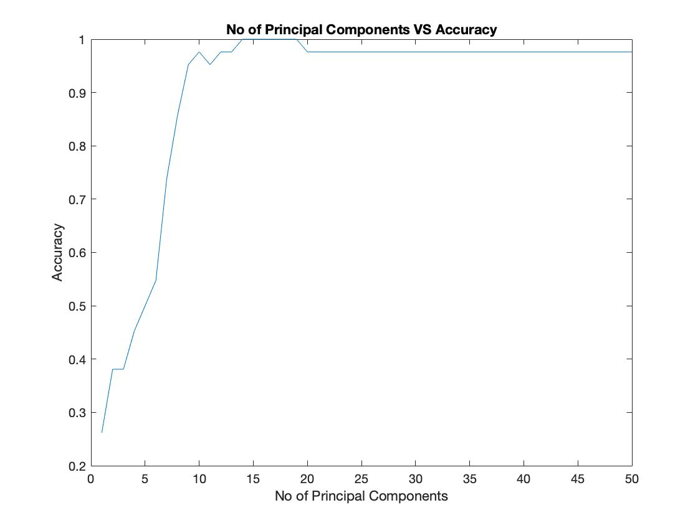

# Eigen Expressions
Problem Description: Face expression classification is a very interesting problem in the field of
Machine Learning. Usually, people prefer using Neural Networks and Convolutional Neural
Networks when working with image data and takes time to train the network. However, we can
use PCA with K nearest neighbor to perform classification much faster with very less training
time. Eigenexpressions is one such implementation of face expression classification using PCA
(for dimensionality reduction) and K Nearest Neighbor (for classification).

Dataset Description:
Dataset name: Japanese Female Facial Expression (JAFFE)
Classes: Angry, Sad, Disgust, Surprise, Happy, Neutral, Fear
Total Images: 214 (172 Training images, 42 Test images)
Image Description: Grayscale images in TIFF format
Link: http://www.kasrl.org/jaffe.html

Pre-processing:
• Each image is resized to a dimension of 52 by 52 and converted to JPG format.
• Renamed images according to expression.
• Performed normalization for brightness and contrast.
• Results also obtained without normalization in order to check the algorithm performance.

Performance Measure:
1. Accuracy: Ratio of correctly predicted images to total testing images
2. Confusion Matrix: 7 by 7 matrix containing no of samples correctly classified and samples
that are wrongly classified.

Optimization:
• In order to increase accuracy on test set I performed optimization by increasing the no of
principal components to a value which yields the highest accuracy.

